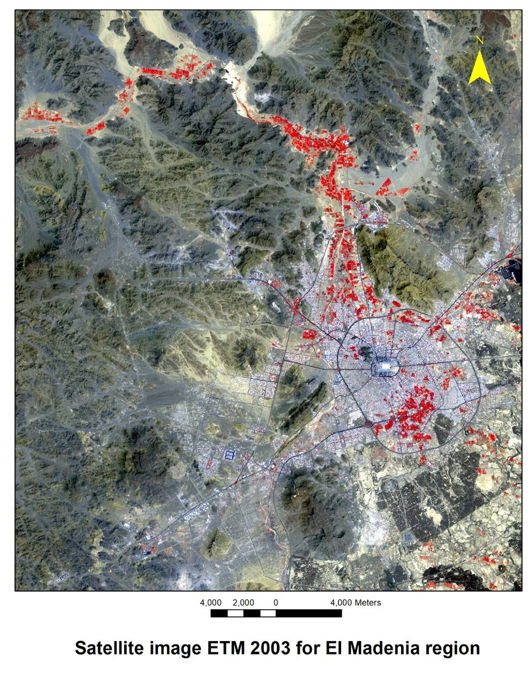
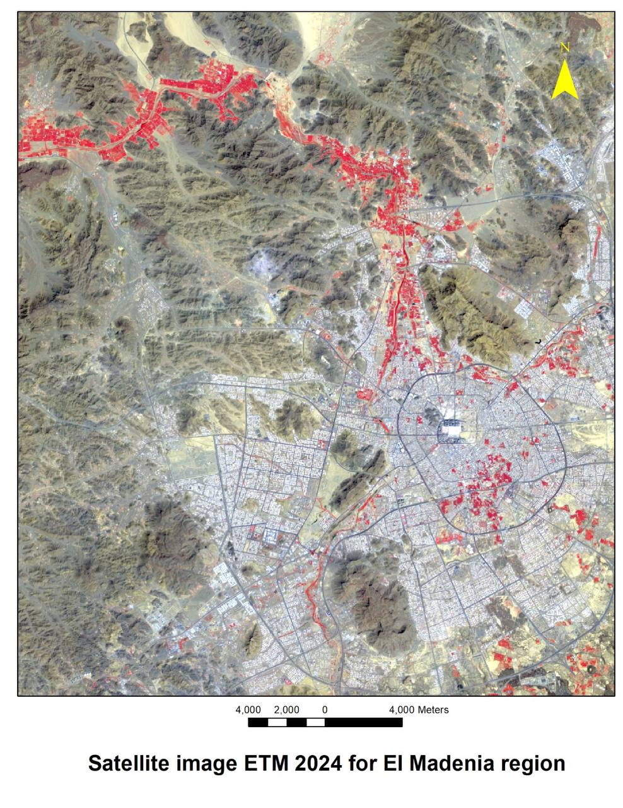

# Graduation Project: Monitoring NDVI in Al-Madinah (2003–2024)

### Project Overview
This project is a study to monitor and analyze changes in vegetation cover in Al-Madinah (specifically Quba and Wadi Al-Aqiq) over a 21-year period. Using Remote Sensing and GIS techniques, we identified environmental trends and desertification patterns to support local sustainability

---

### My Role & Contributions
As a member of the research team, I focused on spatial data preparation and presenting the findings:

* Spatial Data Preparation: I used Google Earth Pro to define study area boundaries using the Polygon Tool. I managed the extraction of KML files, which were the starting point for the spatial analysis
* Theoretical Analysis: I followed the workflow in ArcGIS, learning how to apply the NDVI formula and use the Raster Calculator to distinguish between healthy vegetation and desertified land
* Presentation & Communication: I was responsible for designing the project presentation (PowerPoint) and represented our team at the "Towards a Green Environment" initiative. My goal was to simplify scientific data for Companies, Students, and Environment Professionals

---

### Tools & Techniques
1.  Google Earth Pro: For initial site mapping and boundary definitions
2.  ArcGIS: Used for image processing (Clip tool) and calculating the NDVI
3.  Satellite Data: Analyzed USGS Landsat images comparing the years 2003 and 2024

---

### Achievements
* Grade: Received an A+ grade for technical accuracy and presentation quality
* Impact: Contributed to environmental awareness through public speaking at local initiatives

---

### Visual Results

To analyze environmental changes in Al-Madinah, we compared two satellite images from different years: 2003 and 2024

#### 1. Satellite Image (2003)

*Figure 1: Al-Madinah region vegetation status in 2003.*

#### 2. Satellite Image (2024)

*Figure 2: Al-Madinah region vegetation status in 2024.*

---

### How to Read the Maps
In these specific satellite images, we used a type of color presentation where vegetation looks red to make it easier to see:

* 🔴 Red Areas: Represent Healthy Plants (Farms, parks, and green spaces). We used this color because plants reflect a lot of invisible light (Near-Infrared), and showing it as red highlights them very clearly
* ⚪ Grey Areas: Represent Urban Areas (Buildings, roads, and houses)
* 🟤 Brown Areas: Represent Barren Land and rocky mountains typical of the Al-Madinah region

---

### Key Observations
* 2003 Image: Shows where the original farms and green areas were located
* 2024 Image: Shows how much the city has grown and how the location or amount of green spaces changed over 21 years
